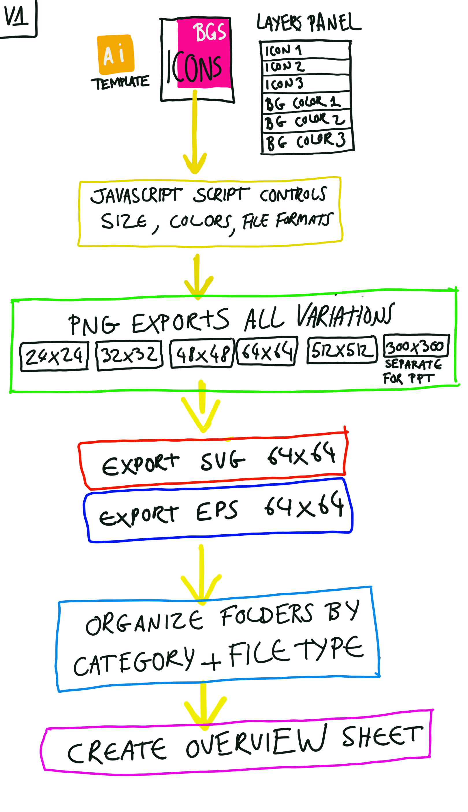
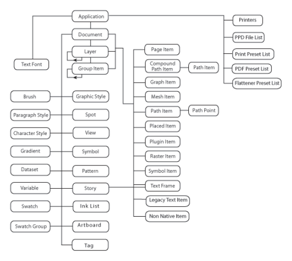

<div id="top"></div>
<!-- PROJECT LOGO -->
<br />
<div align="center">
  <a href="">
    
  </a>

<h3 align="center">A Typescript file that converts into ECMA 3 target JS file for use in Adobe Illustrator 2022. JS script that automates icon export processes in Adobe Illustrator. It will compare the layer of icons against the layer of background colors and export them as PNG at 24, 32, 48, 64, 300, 512, SVG and EPS. It will categorize these outputs to three separate folders: by type, by color and by icon.</h3>

  <p align="center">
    Useful links 
    <br />
    <a href="https://github.com/Artchibald/WTW-illustrator-script"><strong>Explore the docs »</strong></a>
    <br />
    <br />
    ·
    <a href="https://github.com/Artchibald/WTW-illustrator-script/issues">Report Bug</a>
    ·
    <a href="https://github.com/Artchibald/WTW-illustrator-script/issues">Request Feature</a>
        ·

  </p>
</div>

<!-- TABLE OF CONTENTS -->
<details>
  <summary>Table of Contents</summary>
<ol>
   <li><a href="#WTF">Overview</a></li>
   <li><a href="#xxx">TBC</a></li>
      <li><a href="#Promises">TBC</a></li>
   <li>
      <a href="#Core-types">TBC</a>
      <ul>
         <li><a href="#Type-assignment-and-type-inference">TBC</a></li>
         <li><a href="#The-core-job-of-typescript">TBC</a></li>
      </ul>
   </li>
</ol>
</details>

# Video tutorial located on youtube.com

Please consult the video walkthrough to help you get set up using this script:

https://youtu.be/9hrQIdJDNxY

# Overview

This script automates exports from a specific Illustrator template contained in this repo. The script is split into 2 parts. The first part exports and saves the icons to various sorting folders. The second part generates a contact sheet based on the results. The second part goes into all svgs folder and uses it to create the contact sheet.

<p align="right">(<a href="#top">back to top</a>)</p>

# Job Number for correspondance emails subject line for tracking

WTW_51660_Brand Icons_May22 

# Useful links.

- <a href="https://ai-scripting.docsforadobe.dev/">Adobe Illustrator API documentation</a> > This is where all the commands are referenced for re-use.
- <a href="https://extendscript.docsforadobe.dev">Extend Script</a> 

# Built with

- VS code
- VS code extension extend script debugger by Adobe: faster load with play button and much better debugging. Extensions > Install  "ExtendScript Debugger". Follow instructions for better debugging, script stop break points and console returns achieved with this. This is not as good as the Extendscript toolkit that only works on Windows.
- Uses node js dependency types for adobe NPM https://registry.npmjs.org/types-for-adobe
- SOON Extendscript toolkit on Windows

# How long does the script take to run?

If there are 38 icons and 8 background colors, 3 sets of folder saves, that is 7320 total exported icons and roughly (38 x 8 x 3 folders) 4560 loops. This takes about 2 hours to perform. Total of (34*8) 304 icons in the contact sheet.


## Script instructions:

- Make a coffee, this may take a while.  
- If you run the script again, you should probably delete the previous assets created. 
-  Artboard size must be exactly 256px x 256px. 
- Guides must be on a layer called exactly 'Guides (DO NOT MOVE)'. 
- Make sure there are no spaces in the layer names, use hyphens(-) instead.  
- Make sure all layers and sublayers are invisible and unlocked to avoid bugs. <path>s (sub sub sub layers) should remain visible though in layers panel(this is standard). 
- Make sure all icons are on sublayers inside the layer called 'icons' with correct naming. Make sure all colors are on sublayers inside the layer called 'colors' with correct naming. 
- Exported assets will be saved where the .ai file is saved. 

  # How to use  

- Use VS code > Main Menu > Terminal > Run build Task > Choose Build or Watch to convert .TS to .JS

- Set up the Extendscript toolkit debugger VS extension

- You may need the Extendscript toolkit from Adobe. This only works on Windows since OS Catalina, so you'll probably need Windows for better debugging.


```

git pull... repo etc
node installed?
typescript installed?
npm i
Main nav in VS Code: Terminal > Run Build Task > Watch. This watches and compiles TS files.
open .ai in Illustrator
File > Scripts > Other Scripts > Add WTW_main_script.js


```

# Graphical representation



# Illustrator object  model



# How to use this script?

1. Open Adobe illustrator
2. Open the icons template in Illustrator that you will find in this repository (no others, just this one).
3. Go to File > Scripts > Other Scripts...
4. Select the JS file from this repo called XXXXXXXX.js, it will run automatically.
5. View the exported assets in your folder XXXXXX.

<p align="right">(<a href="#top">back to top</a>)</p>

# Brief from client to be implemented

- Take an established artboard (provided by WTW in Illustrator format)
- Set up a script that takes any icon on this artboard and exports it in the prescribed sizes, colors, and file formats —
- the attached Illustrator file sample has layers for each prescribed color for the background and layers for the two color options for the icon that sits - on the square background to demonstrate the options needed.
- PNG - 24, 32, 48, 64, 512 (this is for web, email ppt)
- PNG-300 (for PPT – needs to be grouped separately from the other sizes in above bullet)
- SVG and EPS - 64x64 (two file types)
- Leverage a naming convention (predetermined from WTW that includes icon color, background color, size for pngs)
- TBD
- Possible examples:
- Accuracy-black-UV-64, Accuracy-black-submarine-64, Accuracy-black-mandarin-64, etc.
- Accuracy-dkUV-UV-24, Accuracy-dkUV-submarine-24, Accuracy-dkUV-mandarin-24, etc.
- Set up a script to read files and export a contact sheet
- Automate a process by which files can be stored in one place, wrapped up with contact sheet and Zipped?
- TBD:
- Grouped in folders by Category and by filetype, for example Business Communication SVG, Business Communication EPS, Business Communication PNG (all sizes except 300), Business Communication PPT (300 size only)

# To be done

- need to enlarge the contact sheet to accomodate more icons

- Be sure you allocate time for testing on MacOS and Windows

- If all layers are on show only first

- Organize the readme better

- Simplify repetitions

- Change functions to arrow functions

- if all layers on turn them off before running

- if locked unlock all

# Done

- change all vars to lets

- Remove all typescript bugs from contact sheet script.

- URGENT FROM CLIENT, NAMES in contact sheet

- ignore locked guides layer

- add -24x24 ...etc to all exports AGAIN

- GET Extendscript toolkit for Windows!

- Move colors into its own layer to avoid deleting the guides

- Time off half day tue 31 MAY, need afternoon off
 
- Tuesday 7 June need day off please

- URGENT DISCREPANCY BETWEEN AI FILE AND THE ICON STYLE GRID PDF!!

# Questions for client

Why are there 2 templates core and expressive?

# Timescale breakdown

## Day 1

Github repo set up. Review.
Typescript implementation into repo.
Implemented the latest Javascript tech stack, called Typescript. This is a language created by Microsoft recently, the typescript purpose is to make Javascript less error prone. It is working as expected and suggesting code snippets as it should in my code editor which is great. This will be very useful as we progress.
Reviewed the Javascript code supplied by the client and typescript has flagged some issues I need to address. Parts of the script are not working as expected. I want to re-use as much as I can to save time, this is on going. If I have any new breakthroughs here, I will let you know.
Started writing the new version of the script. Took a while to figure out how to declare the size of the exported pngs. Successfully managed to turn on and off multiple background color layers in the script, and automatically save a set of icons in the 512x512 category with different background colours. These include the color in the filename too. This has lead me to think about how to refactor my code to avoid unnecessary repetitions as I progress.
My next task for this afternoon is to sketch/draw out the functionality/requirements of this script based on the brief from the client. I think that will be useful to make sure we are on the same page. I will send over soon. I will add this to the repository on github.com too.

## Day 2

Nice breakthrough today.
Re-used some parts of the supplied scripts.
The script currently does:

1. show instructions dialog alert
2. creates a folder called 512x512 next to where the illustrator file is saved.
3. Loops through all the icons, however many there may be (12 currently), and saves them as 512x512 PNGS against the background colors (3 currently). 3 x 12 = 36 pngs created. If there were more, it would create more automatically thanks top the loop I created today.
   Now I just have to duplicate that script action for the other png sizes required which should be quite easy: 24x24, 32x32, 48x48, 64x64.
   Next I will write something similar to generate the svgs and EPS versions.
   Saving them with the correct filenames as per client request will be quite easy as it is working as expected.
   Then the client brief talks about a "Contact sheet". A kind of map of all the created assets I assume. I haven't got to this part yet.
   I think this is good progress for day 2.
   I have created an unlisted youtube video to show you the progress:
   https://www.youtube.com/watch?v=N26Mwt0gQoo
   Because I can't attach files to this chat.

## Day 3

Improved readme

Fixed a few major bugs this morning around showing and hiding layers

Successfully exported all correct pngs: 24, 32, 48, 64, 300, 512

Trying to get SVG and EPS to export but I am still trying to get these 2 to work. Hoping to have them ready before Monday.

Some bits we will need soon from the design team:

- Discuss the exact folder structure of the all assets
- Discuss the exact file naming convention
- Can I get an example of the 'Contact sheet' mentioned in the brief please?

## Day 4 Sat fustrated weekend

Nice showing the progress to Mike this morning.
Got SVG and EPS HALF working
Need to figure out MAJOR blocker folder export issue
Did lots of version checks, downgraded output from typescript to ECMA 3
Tried to get extendscript toolkit but it only works on windows because it is 32 bit and os catalina only supports 64 bit now. 
Got SVG and EPS fully working and restructured the main js file.
Moving onto sorting the icons by color or icon type next
Then moving on to Contact sheet functionality.
I think I am ahead of schedule
Have a nice evening.

## Day 5

New Windows laptop device set up
VS Code, Node JS, Illustrator, Chrome, Extendscript toolkit installationss.

While those were loading up:

Set up the new folders we need with the script, to sort everything by color and by icon.

Working on new sorting functions this afternoon, no breakthrough yet

Exploring the new app I am using called the extensdcript toolkit for debugging


[outline]: imagesInReadme/outline.png

[objectmodel]: imagesInReadme/objectmodel.png


## Day 6

Removed a big bug around guide layer
got a script working for the contact sheet
Removed lots of bugs all day
Brief completion as a prototype ready 

## Day 7

Basically removing as many bugs as possible all day long.
Review with Micheal
Review with the design team
Started on adding the filenames to the contact sheet as per last client request, no breakthrough yet.

## Day 8


Working on print filenames to the contact sheet.
Got it working.
Spent quite a bit of time trying to get the text position right.
New bugs appeared I ironed out.
.svg still present in the filenames in the contact sheet, trying to remove.
Liaising with Diane.
Sent new script to Diane.


## Day 9

Implemented three new features in the contact sheet.

- remove string --SVG
- Remove extension .svg
- Fixed space in layer names bug

The contact sheet should be more legible now as a result.

These were done using what is called regex.

Sent to Diane as an updated version with the 3 new features.

There were some typescript errors which are fully rectified too.

Also been refactoring and tweaking the readme and files at https://github.com/Artchibald/WTW-illustrator-script

This may be useful notes if you need someone else to work on this in the distant future. It should help them get up to speed faster.

I don't know if WTW uses Github.com but I can grant admin rights to anyone who requires it.

I think I will be needing your next project to start on tomorrow if at all possible. 

Looking forward to hearing about it on our call at 11am.

## Day 10

Created a video tutorial to help employees get set up faster. https://www.youtube.com/watch?v=9hrQIdJDNxY

Call with Steve and Mike 11am.

Minor liaise with Diane to see if she needs help, she will confirm tomorrow because she hasn't had time to look at it yet.

Reviewing the scripts that were supplied by Monigle in depth and testing it with random icons I create. This will help prepare me for the next step of the script.

Setting up a new repository for the next project and defining some basic readme architecture in there to keep myself busy.

Tomorrow if there is lots of time, I will continue reviewing the supllied scripts in even more depth and I may have some questions for Mike around brand colors and font families used.


## Day 11

Spent the day debugging a bug I hadnt noticed through out around 1 icon wrong sizes throughout
Fixed it around 4pm
Trialled a big script, worked perfectly.
need to enlarge the contact sheet to accomodate more icons